
<h1 align="center">基于SSM框架的健康管理系统+vue</h1>

## 简介
健康管理系统：角色分为管理员、用户；功能包括体检套餐管理、预约体检管理、健康测评管理、用户信息管理，实现便捷的健康数据管理和用户交互体验。    --计算机毕业设计源码；毕设源码；java毕业设计源码

## 联系方式

<h3 align="center">获取完整代码与数据库文件 + 微信：deepguan QQ: 86050149 QQ群: 783742310</h3>

<h3 align="center">可帮忙远程部署 包运行成功！提供远程部署、修改代码、设计文档指导、代码讲解等服务！</h3>

## 功能介绍（完整见运行截图）
管理员：主要功能包括用户登录和注销，提供对健康管理系统的整体模块管理，如体检套餐、健康测评及用户信息的管理。可以添加、删除和修改系统中的健康套餐及测评项目，也可以审核用户的预约和测评报告，并通过筛选和搜索功能高效管理系统数据。个人中心功能允许管理员查看和更新个人资料。

普通用户：用户需通过登录界面访问系统，并可利用个人中心更新和管理个人信息。此角色具有浏览和预约体检套餐的权限，包括体检项目、预约时间及地点的选择。用户可以查看自己的预约情况、取消预约并提交或查看测评报告。此外，用户可通过系统进行健康测评，输入相关数据，并依赖系统提供的健康评估功能管理个人健康信息。

## 运行截图
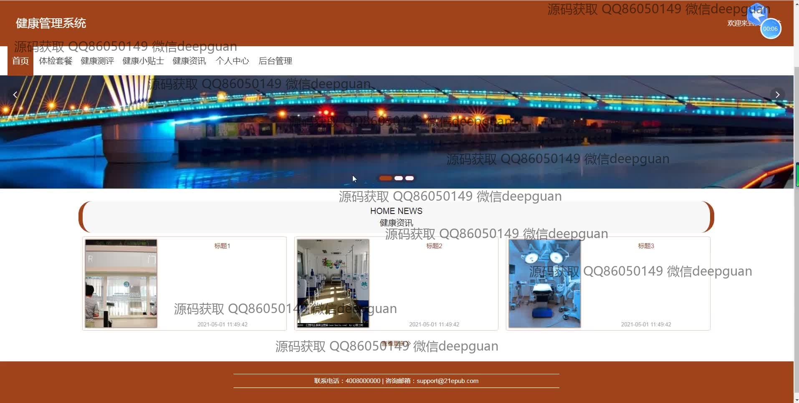
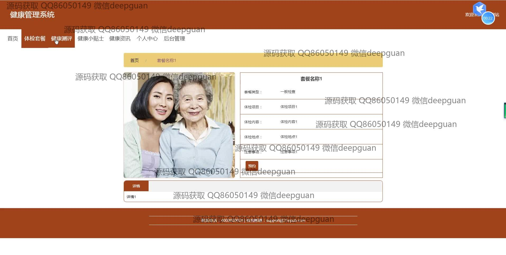
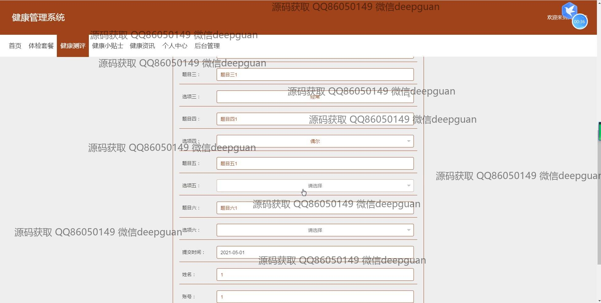
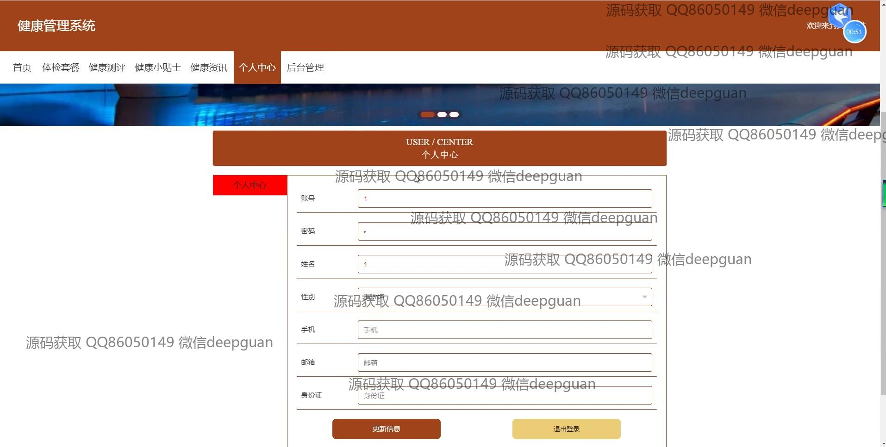
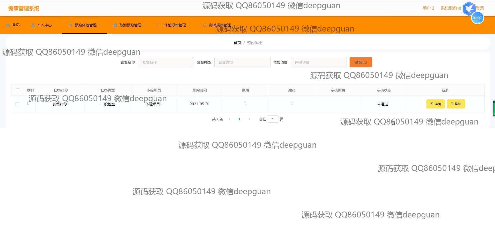
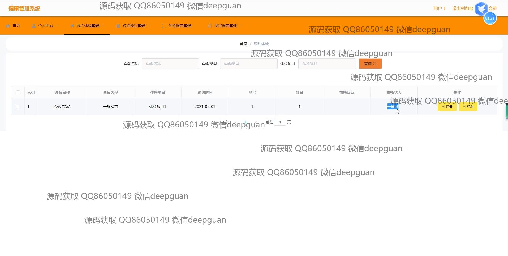
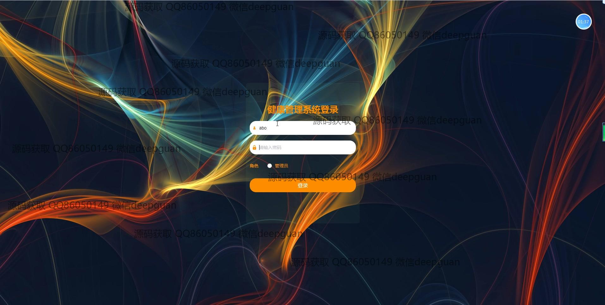

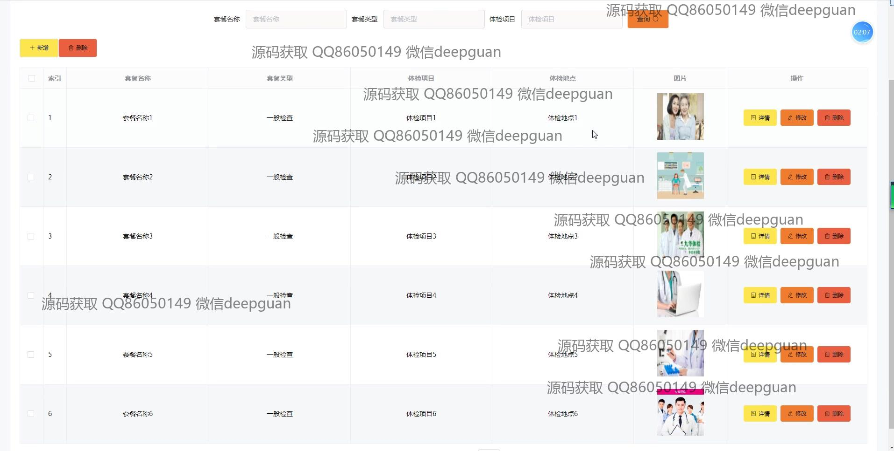
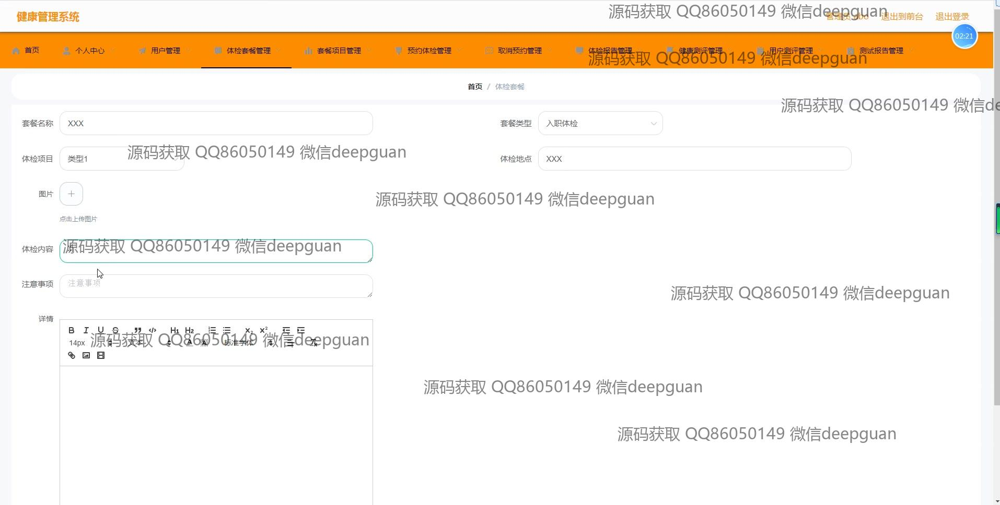
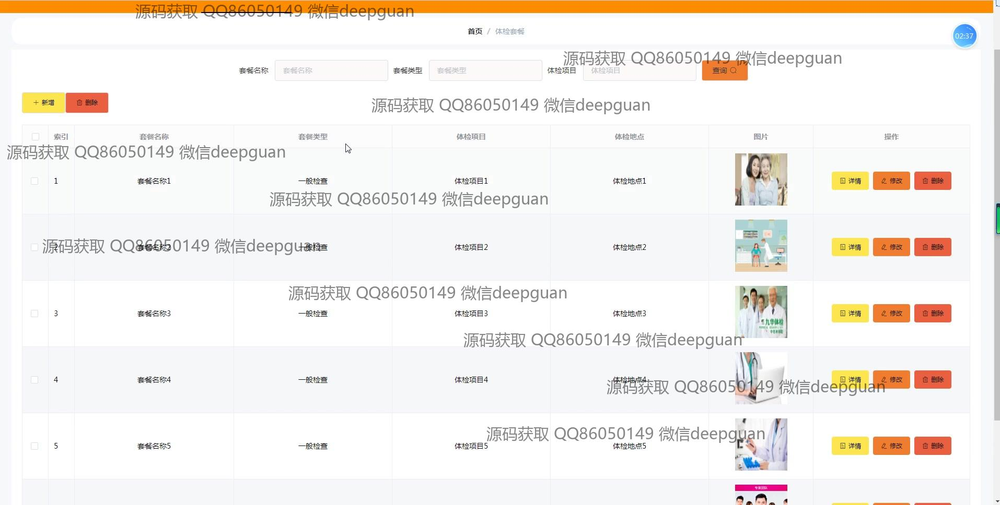
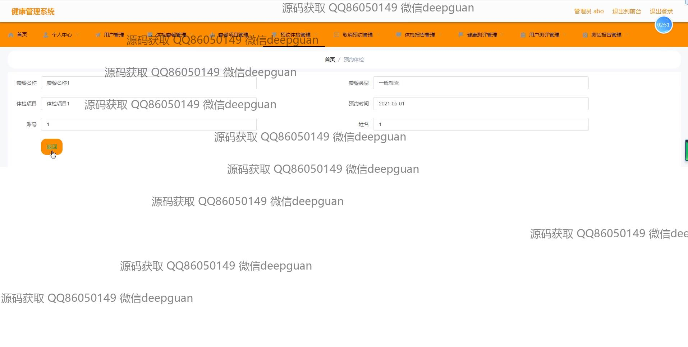
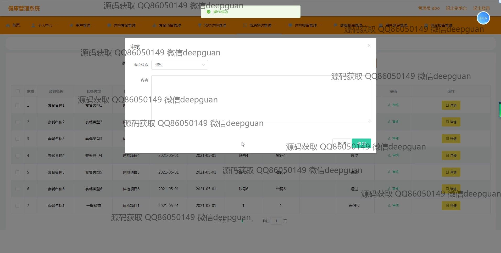
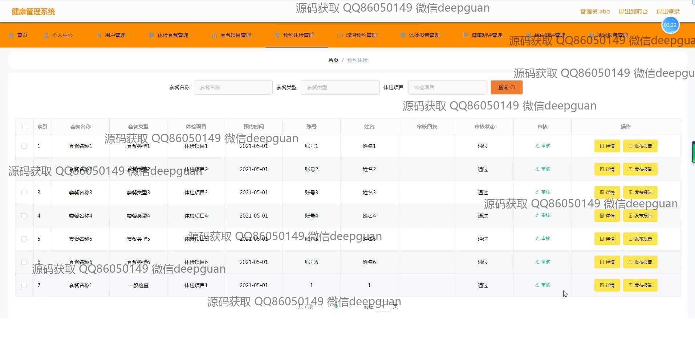
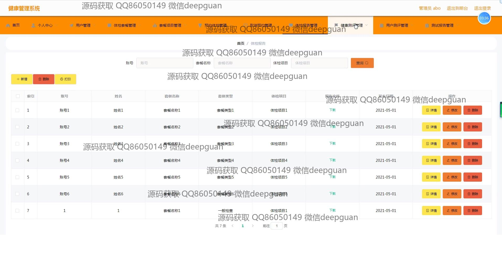
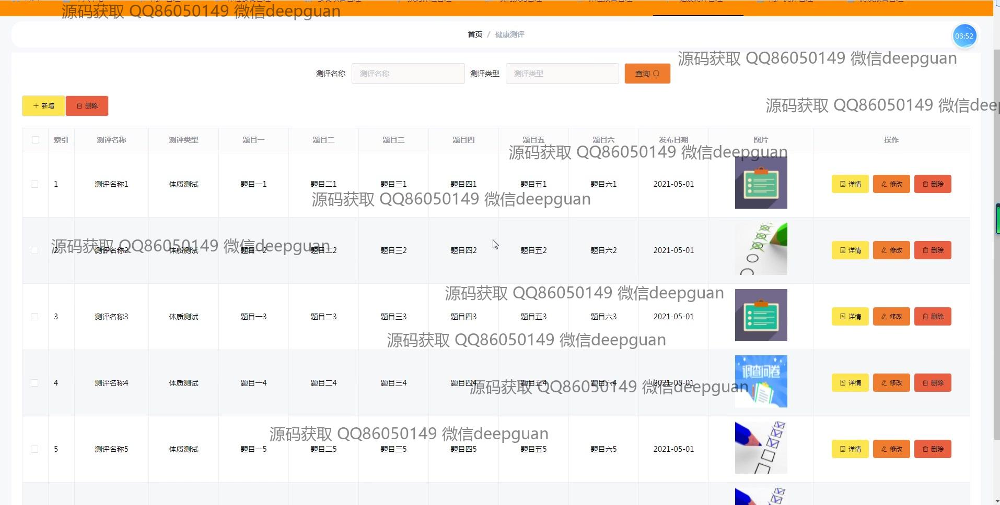
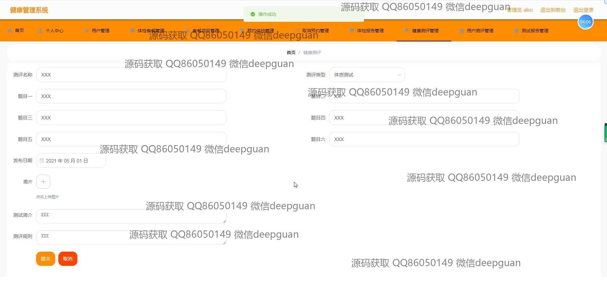
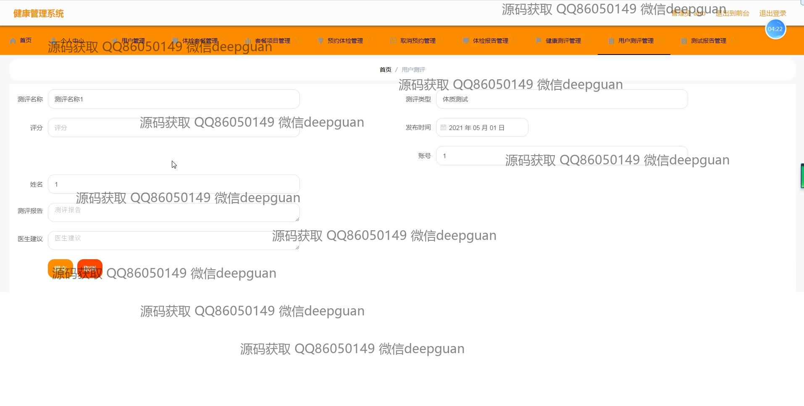
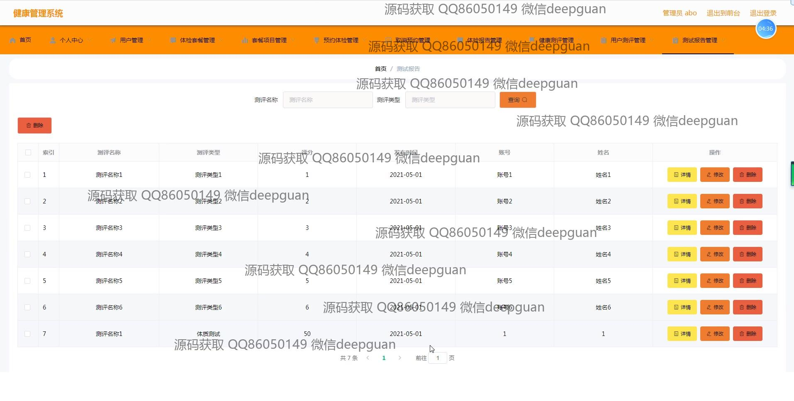
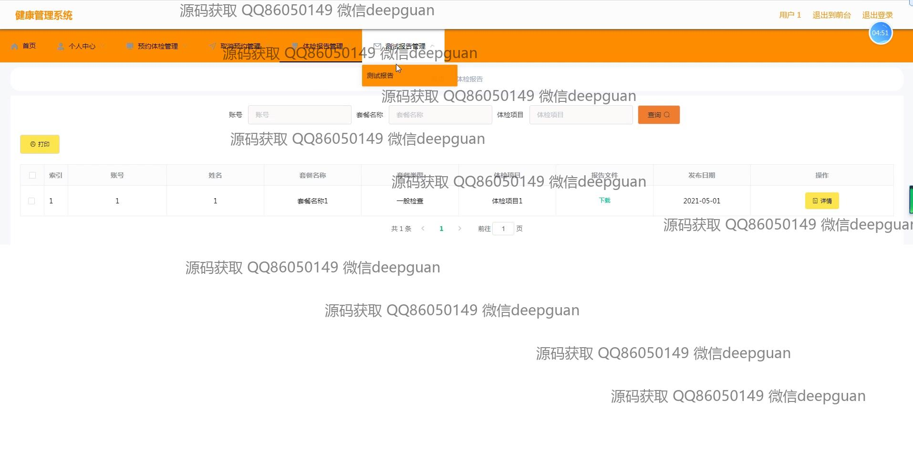

本代码来源于网络,仅供学习参考使用!

